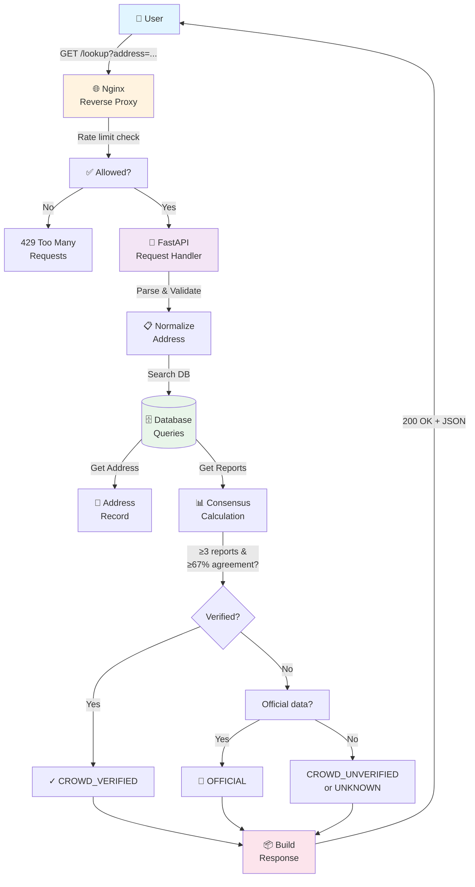
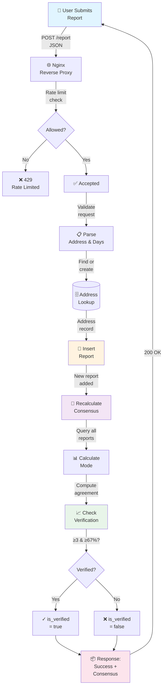
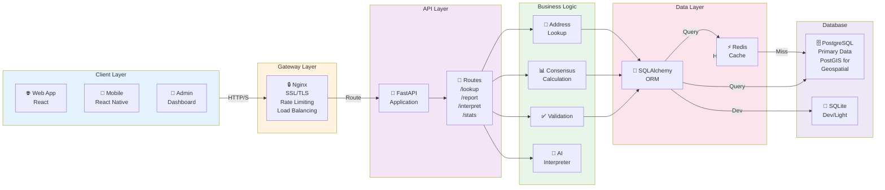
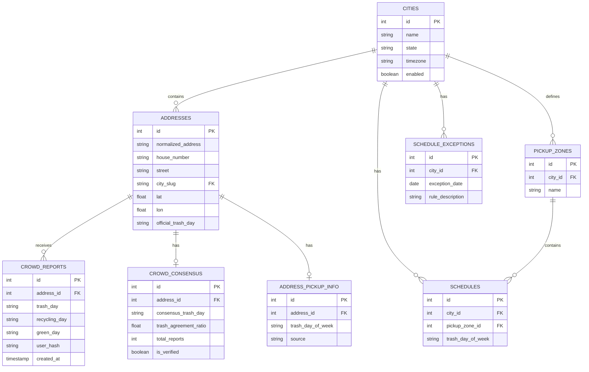
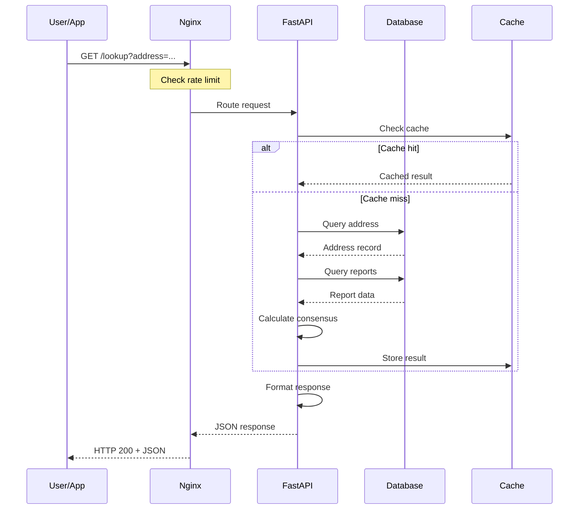
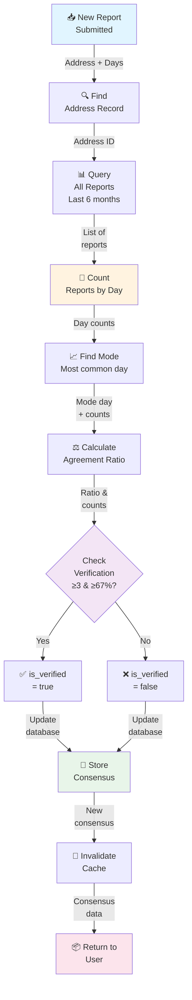
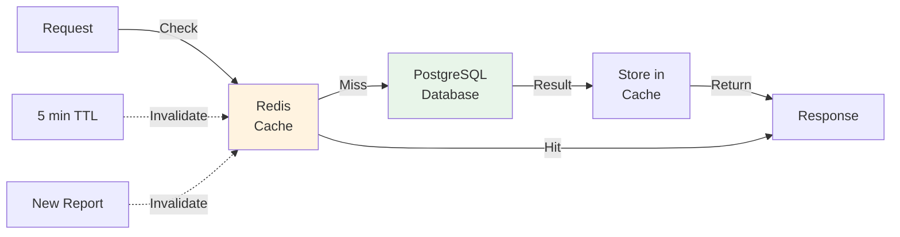

# System Architecture Diagrams

Visual representations of TrashAlert's data flow, components, and interactions.

## Data Flow Diagram

### Address Lookup Flow



### Report Submission Flow



## System Component Diagram



## Data Model Diagram



## Request/Response Cycle



## Consensus Algorithm Flow



## Deployment Architecture

### Development

```
┌─────────────────────┐
│  Developer Machine  │
├─────────────────────┤
│ - Python app        │
│ - SQLite database   │
│ - Localhost:8000    │
└─────────────────────┘
```

### Production

```
┌──────────────────────────────────────────────────┐
│          Cloud Infrastructure                     │
├──────────────────────────────────────────────────┤
│                                                  │
│  ┌────────────────────────────────────┐          │
│  │ Load Balancer / DNS                │          │
│  │ (AWS ELB, Azure LB, etc.)          │          │
│  └──────┬─────────────────────┬───────┘          │
│         │                     │                  │
│  ┌──────▼──────┐    ┌────────▼──────┐           │
│  │ API Server 1│    │ API Server 2   │  ...      │
│  │ - FastAPI   │    │ - FastAPI      │           │
│  │ - Nginx     │    │ - Nginx        │           │
│  └──────┬──────┘    └────────┬───────┘           │
│         │                     │                  │
│         └──────────┬──────────┘                  │
│                    │                            │
│         ┌──────────▼──────────┐                 │
│         │  Shared Services    │                 │
│         ├─────────────────────┤                 │
│         │ - PostgreSQL        │                 │
│         │ - Redis Cache       │                 │
│         │ - Monitoring        │                 │
│         │ - Logging           │                 │
│         └─────────────────────┘                 │
│                                                  │
└──────────────────────────────────────────────────┘
```

## Cache Layer Diagram



## Related Documentation

- **[System Architecture](/docs/architecture/overview)** - Component details
- **[Database Schema](/docs/architecture/database)** - Table definitions
- **[Crowdsourcing Logic](/docs/architecture/crowdsourcing)** - Consensus algorithm

